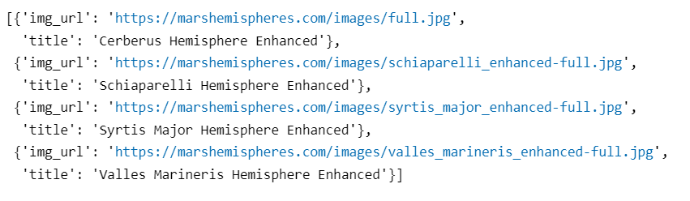
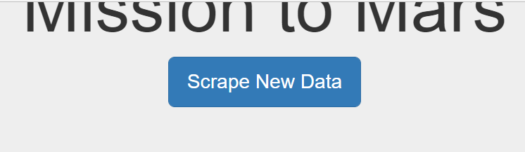
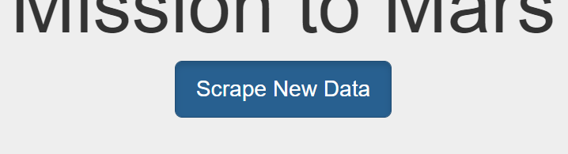
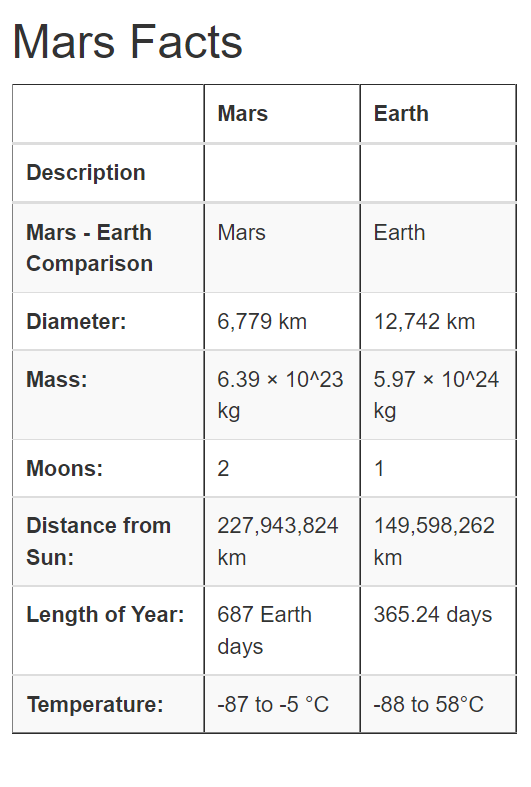
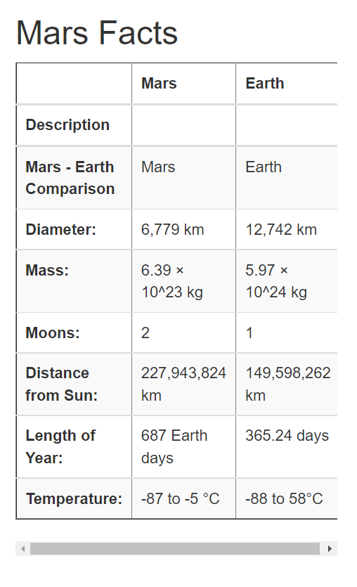

# Mission-to-Mars
## Overiew
### Purpose
To help Robin's web app and achive her goals to full-resolution images of the Mars hemispheres and titles of those images, storing the scaped data on a MongoDB, use a web applicaiton to display the data, and alter the web app to accommodate these images.

## Delivery 1 - Scrape Full-Resolution Mars Hemisphere Images and Titles
Using BeautifulSoup and Splinter, we scrape full-resolution images of Mars’s hemispheres and the titles of those images. The code for scraping Mars hemisperes is written in [Mission_to_Mars_Challenge.ipynb](Mission_to_Mars_Challenge.ipynb)

```Python
#Using BeautifulSoap and Browser dependencies open the Mars page in Chrome.
url = 'https://marshemispheres.com/'

browser.visit(url)

html = browser.html
soup1 = soup(html, 'html.parser')
```

Below code fetches all the Mars Urls

```Python
# 2. Create a list to hold the images and titles.
hemisphere_image_urls = []
hemi_first_link_urls = []
i=3
# 3. Write code to retrieve the image urls and titles for each hemisphere.
imgs_soup = soup1.find_all('img', class_='thumb')

for img_soup in imgs_soup:
    hemisphere = {}
    browser.find_by_tag('img')[i].click()
    html = browser.html
    main_soup = soup(html, 'html.parser')
    main_soup1 = main_soup.find_all('div', class_='wide-image-wrapper')
    if(len(main_soup1) > 0):
      
        hemisphere["img_url"]=f"{url}{main_soup1[0].div.ul.li.a.get('href')}"
        hemisphere["title"]= browser.find_by_css("h2.title").text 
        hemisphere_image_urls.append(hemisphere)
    i = i + 1
    browser.back()
```

### Results 
Url List 
<p align="center"> </p>


## Delivery 2 - Add function to fetch Hemisphere urls and call the function.

We create a function in [Scraping.py](scraping.py) and call the function in scrape_all() method 
```Python

def scrape_all():
...
    # Run all scraping functions and store results in a dictionary
    data = {
        "news_title": news_title,
        "news_paragraph": news_paragraph,
        "featured_image": featured_image(browser),
        "facts": mars_facts(),
        "last_modified": dt.datetime.now(),
        "hemispheres": scrape_hemisphere_Urls(browser) #Added call to Scrape Hemisphere Urls
    }
...
```

```Python
def scrape_hemisphere_Urls(browser):
    # Visit URL
    url = 'https://marshemispheres.com/'
    browser.visit(url)

    html = browser.html
    soup1 = soup(html, 'html.parser')

    # 2. Create a list to hold the images and titles.
    hemisphere_image_urls = []
    hemi_first_link_urls = []
    i=3
    # 3. Write code to retrieve the image urls and titles for each hemisphere.
    imgs_soup = soup1.find_all('img', class_='thumb')

    try:
        for img_soup in imgs_soup:
            hemisphere = {}
            browser.find_by_tag('img')[i].click()
            html = browser.html
            main_soup = soup(html, 'html.parser')
            main_soup1 = main_soup.find_all('div', class_='wide-image-wrapper')
            if(len(main_soup1) > 0):
            
                hemisphere["img_url"]=f"{url}{main_soup1[0].div.ul.li.a.get('href')}"
                hemisphere["title"]= browser.find_by_css("h2.title").text 
                hemisphere_image_urls.append(hemisphere)
            i = i + 1
            browser.back()

    except AttributeError:
        return None
    
    return hemisphere_image_urls
```

### Results 
The full resolution Hemispere images are displayed in tiled 
<p align="center"> </p>

## Delivery 3 - Bootstrap 3 Components
In order to apply bootstrap changes we have to make changes to the [Index.html](Index.html)

**1) Making the Scraping Button Active by default**
```html
 <p><a class="btn btn-primary btn-lg active" href="/scrape" role="button">Scrape New Data</a></p>
```
Before and After Images
<p align="center">  </p>

**2) Making Facts data responsive - This will add the scroll bar so if we resize the browser it doesnt change the position of table, just adds the scroll bar to adjust**

```html
 <div class="table table-responsive" id="mars-facts" style="overflow-x:auto;" >
```
Before and After Images
<p align="center">  </p>

**3) Display all the Hemisphere data in single line.**

```html
  <div class="col-md-3">
```
Before and After Images
<p align="center">  </p>
